# Multi-Modal Anomaly Detection Using Time Series + NLP + GenAI

This project demonstrates an end-to-end prototype for detecting anomalies in oil-rig sensor data, correlating them with operator logs using NLP, and generating human-readable insights using GenAI.

---

## 🚀 Pipeline Architecture

### **1. Synthetic Data Generation**
- **Sensor Data (Pressure, Temperature, Vibration)**  
  Simulated for multiple equipment units with:
  - normal behavior  
  - gradual anomalies  
  - sudden spikes  
  - noise  
  - missing values  

- **Operator Logs**  
  Generated based on volatility in sensor data.  
  Logs reference:
  - equipment  
  - sensor type  
  - observation text  

---

### **2. Preprocessing Layer**
- Pivot to wide multivariate format:  
  `[pressure, temperature, vibration]`  
- Forward-fill, backward-fill, median imputation  
- Sorting by timestamp and equipment  

---

### **3. Multivariate Anomaly Detection (Isolation Forest)**
- Works on the multivariate feature vector per timestamp  
- Produces:
  - `anomaly_score`  
  - `is_anomaly` flag  
- Detects nonlinear interactions between sensors that simple std-dev cannot capture  

---

### **4. NLP-Based Log Correlation**
Logs are matched to anomalies using a hybrid approach:

1. **Time-window filter** (±2 hours)  
2. **Equipment ID match**  
3. **Text Embeddings (TF-IDF or BERT)**  
4. **Cosine Similarity Ranking**  
5. **Top-K relevant logs per anomaly**  

This creates a **semantic relation** between sensor anomalies and operator observations.

---

### **5. GenAI Insight Generator**
A large language model (LLaMA/Mistral/etc.) is used to generate:

- anomaly summaries  
- equipment-level insights  
- root-cause hypotheses  
- operator log interpretation  
- maintenance recommendations  

This provides a human-ready interpretation layer.

---

### **6. Presentation Layer**
- CLI or Streamlit UI  
- Outputs:
  - sensor data  
  - anomalies  
  - correlated logs  
  - final GenAI narrative report  
---
### High-Level Architecture Diagram

```mermaid
%%{init: {'theme':'base', 'themeVariables': { 'primaryColor':'#e3f2fd','primaryTextColor':'#000','primaryBorderColor':'#1976d2','lineColor':'#1976d2','secondaryColor':'#fff3e0','tertiaryColor':'#f3e5f5'}}}%%

graph TB
    subgraph Input["📥 INPUT LAYER"]
        A1[Sensor Time Series<br/>pressure, temperature, vibration]
        A2[Operator Logs<br/>maintenance notes, observations]
    end

    subgraph Processing["⚙️ PROCESSING LAYER"]
        B1[Data Preprocessing<br/>• Pivot to wide format<br/>• Handle missing values<br/>• Forward-fill → Backfill → Median]
        
        B2[Anomaly Detection<br/>• IsolationForest<br/>• Contamination: 3%<br/>• Features: 3 sensors]
        
        B3[Text Processing<br/>• TF-IDF Vectorization<br/>• Cosine Similarity<br/>• Time Window Filter ±2h]
    end

    subgraph Intelligence["🧠 INTELLIGENCE LAYER"]
        C1[Rule-Based Insights<br/>• Sensor pattern analysis<br/>• Likely causes mapping<br/>• Severity assessment]
        
        C2[GenAI Enhancement<br/>• Ollama / Llama 3.2<br/>• Natural language summaries<br/>• Root cause hypotheses]
    end

    subgraph Output["📤 OUTPUT LAYER"]
        D1[Anomalies CSV<br/>with scores & flags]
        D2[Correlated Logs CSV<br/>anomaly-log pairs]
        D3[Summary Report<br/>human-readable insights]
    end

    subgraph Interfaces["🖥️ INTERFACE LAYER"]
        E1[Dashboard<br/>Streamlit web UI]
    end

    A1 --> B1
    A2 --> B3
    B1 --> B2
    B2 --> C1
    B2 --> D1
    B3 --> D2
    A2 --> B3
    C1 --> D3
    C2 -.->|Optional| D3
    
    D1 --> E1
    D2 --> E1
    D3 --> E1

    classDef inputStyle fill:#e3f2fd,stroke:#1976d2,stroke-width:2px,color:#000
    classDef processStyle fill:#fff3e0,stroke:#f57c00,stroke-width:2px,color:#000
    classDef intelligenceStyle fill:#f3e5f5,stroke:#7b1fa2,stroke-width:2px,color:#000
    classDef outputStyle fill:#e8f5e9,stroke:#388e3c,stroke-width:2px,color:#000
    classDef interfaceStyle fill:#fce4ec,stroke:#c2185b,stroke-width:2px,color:#000

    class A1,A2 inputStyle
    class B1,B2,B3 processStyle
    class C1,C2 intelligenceStyle
    class D1,D2,D3 outputStyle
    class E1 interfaceStyle
```

---

## 🎯 Key Decisions & Trade-Offs

### **1. Isolation Forest vs LSTM Autoencoder**
**Decision:** Use Isolation Forest  
**Trade-off:**  
- ✔ Fast, simple, unsupervised  
- ✔ Works well for multivariate tabular sensor data  
- ✔ No need for heavy compute  
- ✘ Does not capture temporal sequence patterns  
- ✘ Contamination parameter forces fixed anomaly rate  

---

### **2. TF-IDF vs BERT for Log Embeddings**
**Decision:** Start with TF-IDF for prototype  
**Trade-off:**  
- ✔ Lightweight and easy to integrate  
- ✔ No GPU dependency  
- ✘ Limited semantic understanding  
- ✘ Misses domain-specific linguistic patterns  

---

### **3. Rule-Based GenAI vs True LLM Calls**
**Decision:** Use rule-based summaries internally  
**Trade-off:**  
- ✔ Runs offline, self-contained  
- ✘ Less expressive than real LLM outputs  

---

## ⚠️ Failure Points & Limitations

### **1. High False Positives in Anomaly Detection**
- Isolation Forest forces anomalies based on `contamination`  
- Some anomalies may be noise, not true faults  

### **2. Weak Log Correlation When Logs Are Sparse**
- If no logs exist in the selected time window, correlation fails  
- Logs may describe unrelated issues  

### **3. TF-IDF Cannot Capture Deep Semantic Meaning**
- Misses context, abbreviations, domain vocabulary  
- BERT/Sentence-BERT would perform better  

### **4. No True Temporal Modeling**
- Sensor drift/seasonality not explicitly modeled  
- Could miss long-term degradation patterns  

### **5. Purely Synthetic Data**
- Real operational edge cases not represented  
- Noise distributions may not match real machinery  

---

## 🔮 Future Work

### **1. Better Anomaly Detection**
- LSTM Autoencoder  
- Transformer-based time-series models  
- Online/real-time drift detection  

---

### **2. Replace TF-IDF with Sentence-BERT**
- Better similarity matching  
- Domain finetuning for operator vocabulary 

---

### **3. GenAI Summarization** 
- Build prompt templates for:
  - RCA  
  - summaries  
  - anomaly explanations  

---

### **4. Streamlit Dashboard**
- Interactive sensor plots  
- Click anomalies to view correlated logs  
- LLM-generated explanations in real time  

---

### **5. Real-Time Pipeline** 
- Real-time anomaly scoring  
- Live GenAI summaries  
- Alerts & notifications

---
